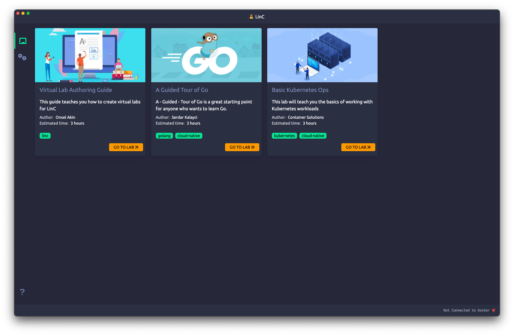

## What is LinC?

Linc is a desktop application that lets you learn new technologies for free. It uses the virtual labs created by the
members of the cloud community. (Please see the Virtual Lab Authoring Guide in the app)



To run:

```bash
npm install
npm run start
```
